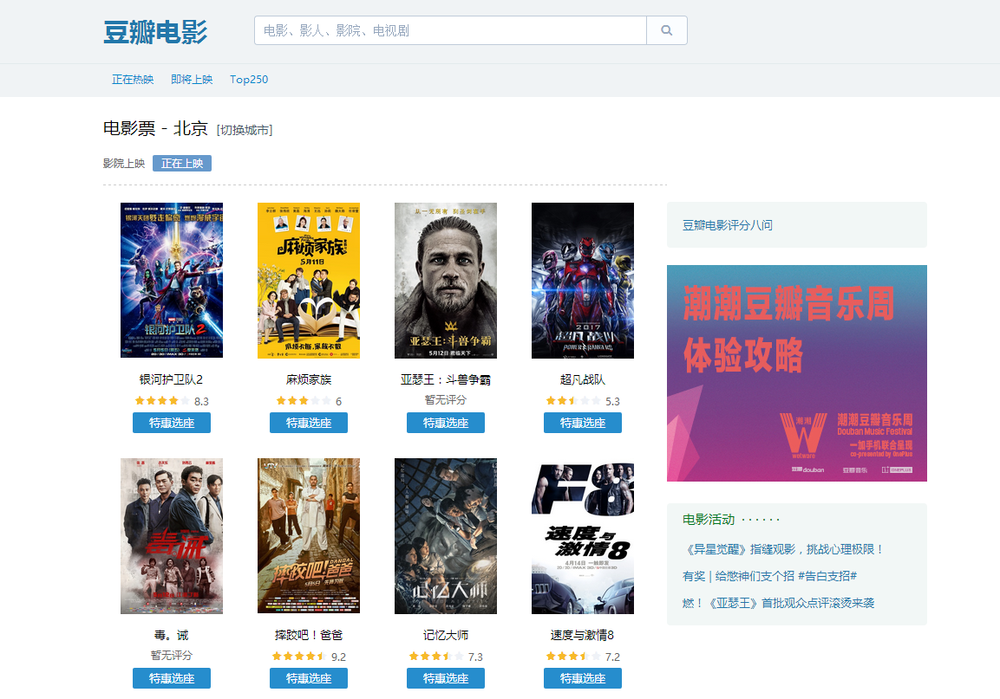

# 豆瓣电影

> douban movie create by vue2

## Build Setup

``` bash
npm install
npm run dev
npm run build
```

## 项目主页展示

 

## 项目功能

- 正在热映、即将上映、top250、电影详情页和搜索页展示
- 地区切换
- 加载更多
- 搜索
- 滚动加载

## Vue-cli

使用vue-cli脚手架搭建，按照步骤执行即可

``` bash
npm install -g vue-cli
vue init webpack doubanMovie
cd doubanMovie
npm install
npm run dev
```

## Element-ui

ui库使用的是element-ui,直接引用使用

``` bash
import Element from 'element-ui'
Vue.use(Element)
```

## Vue-router2

路由使用的是默认的hash模式，后续打算更改为html5 history模式

## 请求豆瓣api

在proxyTable中配置代理
``` bash
proxyTable: {
    '/api': {
        target: 'http://api.douban.com/v2',
        changeOrigin: true,
        pathRewrite: {
            '^/api': ''
        }
    }
}
```
项目中使用了以下api
- /v2/movie/in_theaters 正在上映的电影
- /v2/movie/coming_soon 即将上映的电影
- /v2/movie/subject/:id  单个电影信息
- /v2/movie/search?q={text} 电影搜索

### vue-resource

这里使用vue-resource进行数据交互、不过更推荐使用axios

## Vuex

vuex用来管理全局状态，用起来很方便，可以查看vuex文档进行学习
