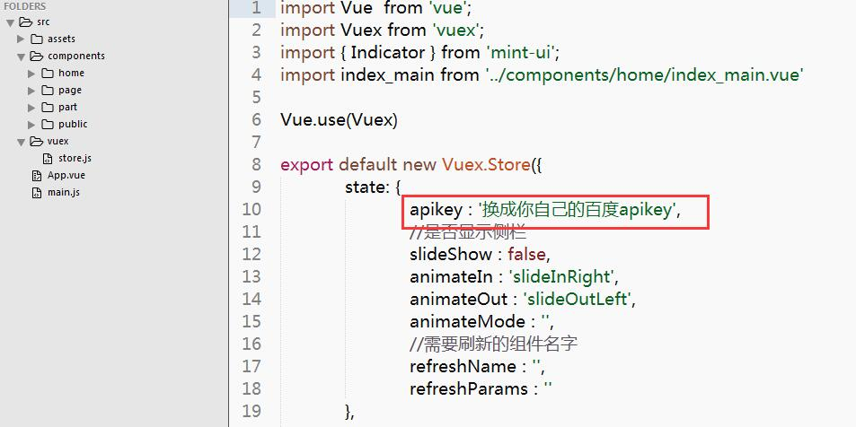

# vue-trip

* * *
# 2017年2月7日更新
### 因为百度的api不能用了，所以我自己加了点数据进去，现在起码能看了，大家需要的话还是可以将就着看的。。(ps:所有天气的数据和热点的数据我是没有填充的)
* * *

# 很不幸，，拥有"高尚品德"的百度家的api不再免费了，项目中的数据都显示不出来了，这个项目玩完了，，，大家都散了吧。


--------以下是原文------------

> 一个用vue2.0做的《出行》webapp，可以查询文章，天气，和城市热点


## 用到的知识点有
- vue2.0
- vue-router
- vuex
- vue-resource
- mint-ui

## 查看例子

- [demo例子](http://http://vue-trip.wenye123.com//#/)
- 首页
- 
- 手机的网址请扫描下方的二维码
- 
- 已经用cordova打包成安卓app，app下载请扫描下方二维码
- 


## 开始

 - 复制或下载本项目到你的仓库
 - 进入你本地的文件夹，然后安装依赖
 - 进入到`/src/vuex/store.js`将state中的apikey换成你自己的百度apikey ([百度apistore](http://apistore.baidu.com/))
 - 

``` javascript
npm install
```

## 查看效果
``` javascript
npm run dev

```

## 打包

``` javascript
npm run build

```