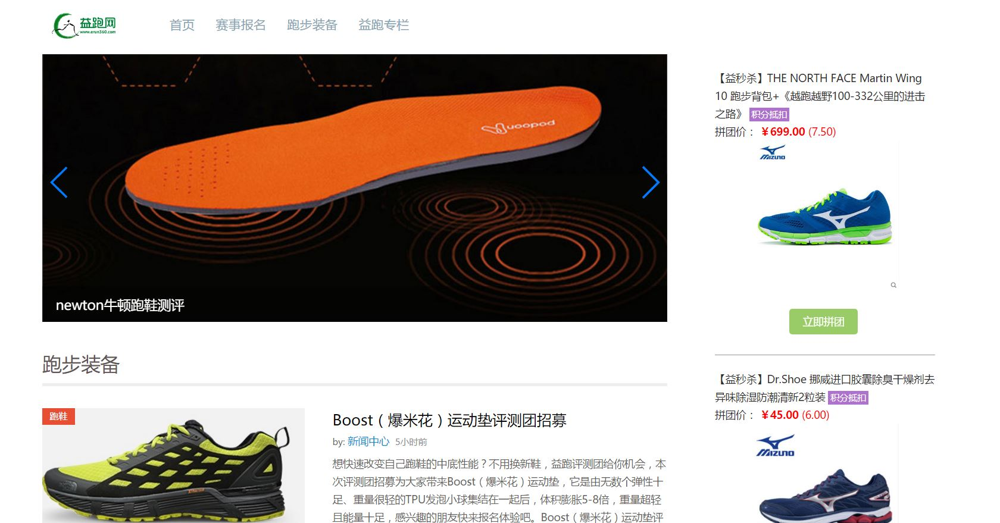

# 基于Vue-cli的PC端SPA实践（Yipao）

> A Simple Vue2.0 project （IE9+）
> Still underConstruction
> 基于Vue-cli的PC端SPA
> Based on Vue-cli for PC SPA（仿·益跑网）

## Demo

https://laclys.github.io/yipao/dist/index.html

## Stack

Vue2.0+Vue-router2+Webpack2+ES6+Sass+Vue-lazyload+Vue-awesome-swiper

## Build Setup

``` bash
# install dependencies
npm install

# serve with hot reload at localhost:8080
npm run dev

# build for production with minification
npm run build

# build for production and view the bundle analyzer report
npm run build --report
```

## Directory structure
```
├─src
│  │  App.vue
│  │  main.js
│  │
│  ├─assets
│  │      index_fixed.png
│  │      logo.png
│  │
│  └─components
│      ├─column
│      │      column.vue
│      │
│      ├─enroll
│      │      enroll.vue
│      │
│      ├─equip
│      │      equip.vue
│      │
│      ├─footer
│      │      footer.vue
│      │
│      └─index
│              index.vue
│
└─static //(reset.css and image files)
└─index.html
```
## Demo images





## TODO

> 进一步组件化

> 性能优化

## Thanks